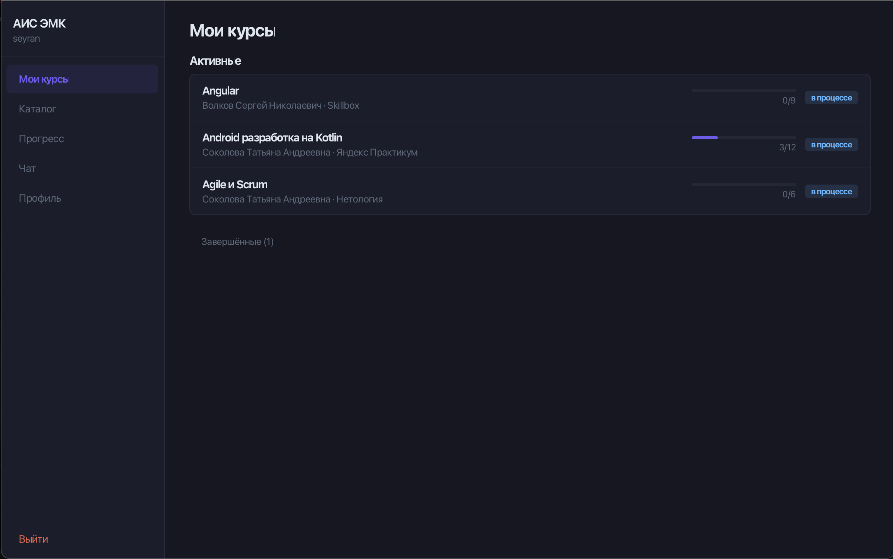
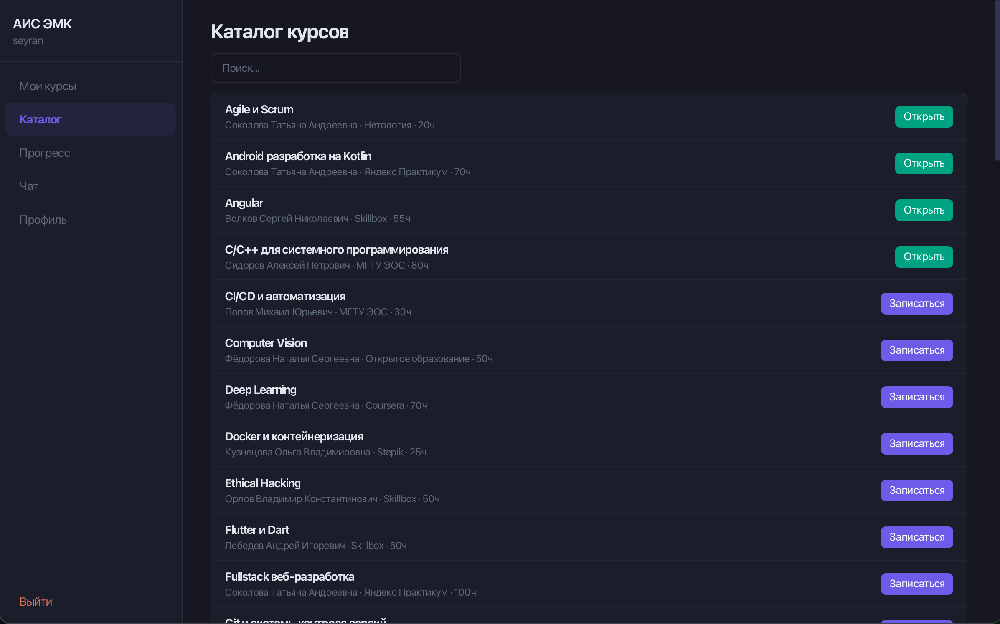
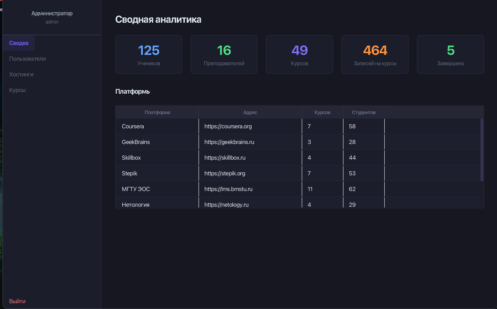
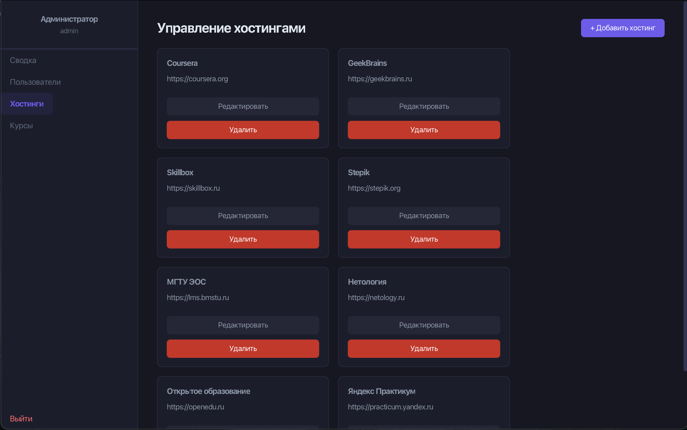
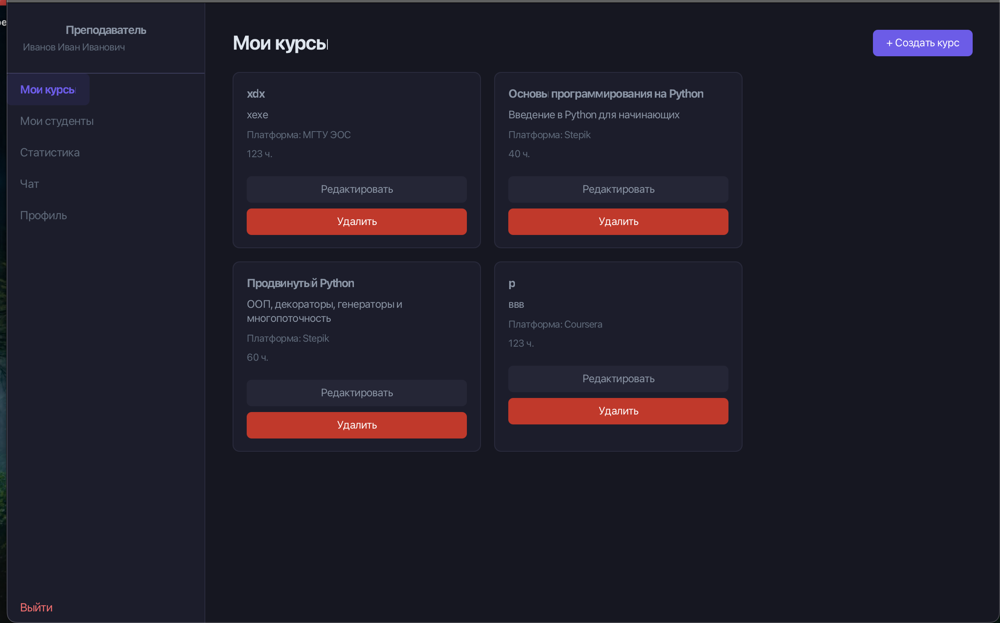
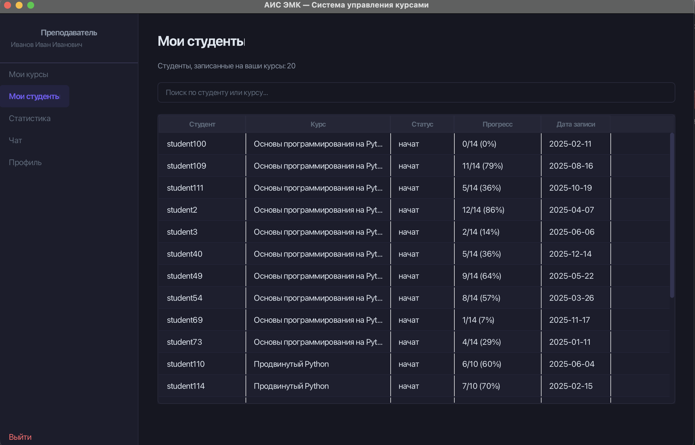
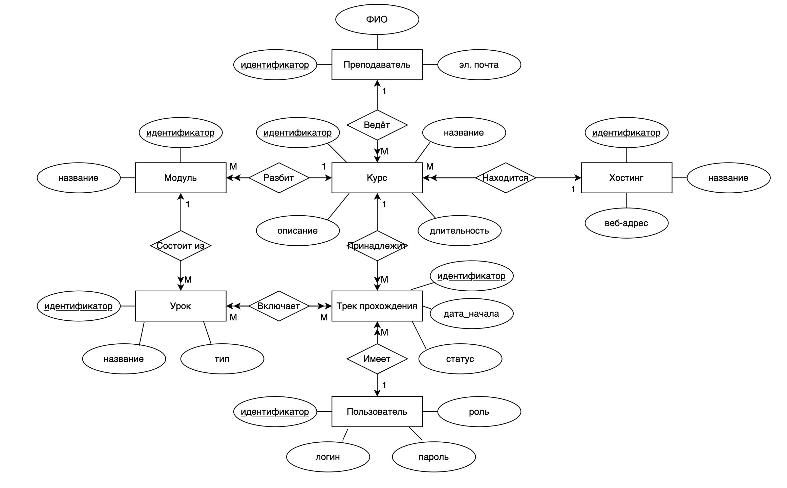

## Практическое задание №3


### DDD — Доменные зоны

Приложение разделено на 5 доменных зон.

#### 1. Управление контентом (Content)
**Описание:** ядро системы — создание и хранение учебных материалов с иерархической структурой.

**Глоссарий:**
- **Курс (Course)** — корневая образовательная единица, имеет название, описание, длительность, преподавателя и хостинг размещения
- **Модуль (Module)** — раздел курса, содержит уроки, принадлежит ровно одному курсу
- **Урок (Lesson)** — атомарная единица обучения, имеет название и тип контента (видео, текст, документ)
- **Хостинг (Platform)** — внешняя платформа размещения курса (Coursera, Stepik), имеет название и веб-адрес

#### 2. Обучение и прогресс (Learning)
**Описание:** взаимодействие пользователя с контентом и трекинг прохождения.

**Глоссарий:**
- **Трек прохождения (ProgressTrack)** — запись о прохождении пользователем уроков курса; имеет дату начала и статус
- **Статус (Status)** — состояние трека: `начат` → `завершён` (только вперёд)

#### 3. Управление пользователями (Identity)
**Описание:** учётные записи, преподаватели, авторизация.

**Глоссарий:**
- **Пользователь (User)** — учётная запись, имеет логин, пароль и роль (Студент / Преподаватель / Администратор)
- **Преподаватель (Teacher)** — отдельная сущность с ФИО и эл. почтой, ведёт один или несколько курсов

#### 4. Аналитика и отчётность (Analytics)
**Описание:** агрегирование данных о треках прохождения и формирование отчётов.

**Глоссарий:**
- **Аналитика курса** — процент завершения, среднее время прохождения
- **Дашборд преподавателя** — успеваемость студентов по его курсам
- **Сводный отчёт** — статистика по системе для администратора


### BDD

**Выбранный путь:** *Студент проходит урок и отмечает его завершённым.*

#### Сценарий успеха

```
Дано
  Студент авторизован в системе
  И студент записан на курс «Базы данных»
  И студент находится на странице урока «ER-диаграммы»
  И статус урока «начат»
  И это не последний урок в модуле

Когда
  Студент нажимает кнопку «Отметить как пройденный»

Тогда
  Статус урока меняется с «начат» на «завершён»
  И прогресс по курсу пересчитывается (например, 5 из 10 → 6 из 10)
  И в боковом меню напротив урока появляется зелёная галочка
  И автоматически открывается следующий урок «Нормализация»
  И в дашборде преподавателя у студента обновляется строка прогресса
```

### Сценарий отказа

```
Дано
  Студент авторизован в системе
  И студент находится на странице урока «ER-диаграммы»
  Но студент НЕ записан на курс «Базы данных»
  (например, перешёл по прямой ссылке от знакомого)

Когда
  Студент нажимает кнопку «Отметить как пройденный»

Тогда
  Запись прогресса в БД НЕ создаётся
  И система показывает тостер «Вы не записаны на этот курс»
  И появляется кнопка «Записаться на курс»
  И статус урока остаётся неизменным
```

### Карты страниц 


#### 1. Страница ученика 



#### 2. Каталог курсов ученика



#### 3. Страница админа



#### 4. Страница создание, удаление и редактирования хостингов



#### 5. Страница преподавателя



#### 6. Страница с поиском и с просмотром данных студентов преподавателя 



### API-First — JSON-контракты

Спроектированы 2 главные ручки для критического пути.

#### Ручка 1 — Запись на курс

**`POST /v1/courses/{course_id}/progress-tracks`**

При записи на курс система создаёт **трек прохождения** для пользователя.

**Request:**
```json
{}
```

**Response 201 Created:**
```json
{
  "progress_track_id": 1567,
  "course_id": 42,
  "user_id": 89,
  "started_at": "2025-05-01T10:15:00Z",
  "status": "начат",
  "first_lesson": {
    "lesson_id": 101,
    "title": "Что такое БД",
    "type": "видео",
    "url": "/courses/42/lessons/101"
  }
}
```

**Response 409 Conflict** (трек по этому курсу уже существует):
```json
{
  "error": "TRACK_ALREADY_EXISTS",
  "message": "У вас уже есть трек прохождения по этому курсу",
  "existing_track_id": 1234
}
```

**Response 400 Bad Request** (курс недоступен):
```json
{
  "error": "COURSE_UNAVAILABLE",
  "message": "Курс недоступен для записи"
}
```

---

#### Ручка 2 — Отметка урока пройденным

**`PATCH /v1/progress-tracks/{track_id}/lessons/{lesson_id}`**

**Request:**
```json
{
  "status": "завершён"
}
```

**Response 200 OK:**
```json
{
  "progress_track_id": 1567,
  "lesson_id": 101,
  "status": "завершён",
  "course_progress": {
    "completed_lessons": 6,
    "total_lessons": 10,
    "percentage": 60
  },
  "next_lesson": {
    "lesson_id": 102,
    "title": "Нормализация",
    "type": "видео",
    "url": "/courses/42/lessons/102"
  },
  "course_completed": false
}
```

**Response 403 Forbidden** (нет трека прохождения по этому курсу):
```json
{
  "error": "TRACK_NOT_FOUND",
  "message": "У вас нет активного трека прохождения по этому курсу"
}
```

**Response 422 Unprocessable Entity** (попытка обратного перехода):
```json
{
  "error": "INVALID_STATUS_TRANSITION",
  "message": "Возврат к предыдущему статусу запрещён",
  "current_status": "завершён"
}
```



